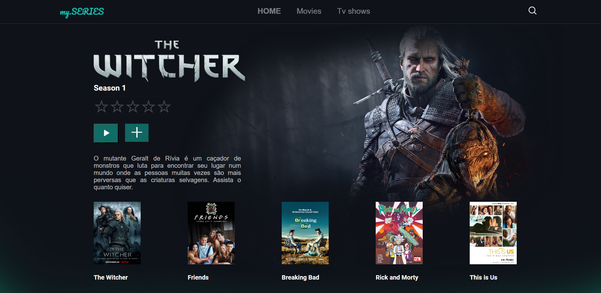

# Template-de-series

Este projeto é um template de site de séries, desenvolvido com HTML e CSS puro, pensado para exibir informações sobre séries de forma visualmente atraente e organizada.

Funcionalidades:
Página inicial estilizada, destacando as séries em cartaz ou populares.
Seções temáticas, como "Séries em Destaque", "Gêneros" e "Novidades".
Cartões de séries com título, imagem e breve descrição.
Design totalmente responsivo, adaptado para diferentes dispositivos (mobile, tablet e desktop).
Uso de animações CSS para transições suaves, como ao passar o cursor sobre as séries.
Objetivo do projeto:
Praticar e aplicar habilidades de front-end, como:

Estruturação de páginas temáticas com HTML semântico.
Estilização moderna e visualmente agradável com CSS.
Implementação de design responsivo com media queries.
Este template é ideal para quem deseja criar ou se inspirar em projetos voltados para séries, oferecendo uma base funcional e estilizada para sites temáticos.
